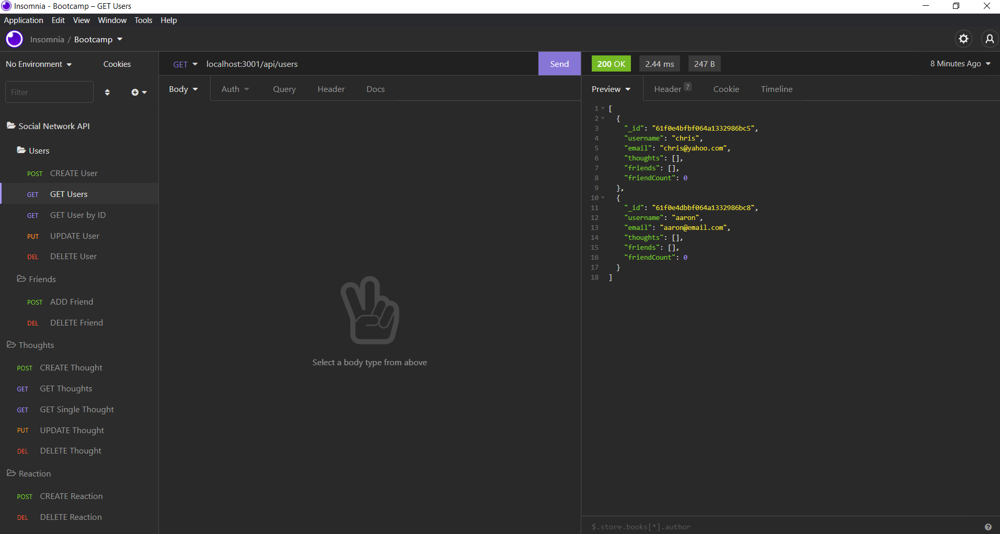

# Social-Network-Api

  

  ## Table of Contents
  - [Description](#Description)
  - [Installation](#Installation)
  - [Usage](#Usage)
  - [Demonstration](#Demonstration)
  - [Tests](#Tests)
  - [License](#License)
  - [Questions](#Questions)

  ## Screenshot
  

  ## Description
  This project allows you to create an API for a social network database. You can add, update, and delete users, add or remove friends, add, update, and delete thoughts, and add and delete reactions to those thoughts.

  ## Installation
  Open the project in the terminal, then "type npm i"

  ## Usage
  Open the terminal, then type "npm start." Then open local host in Insomnia.

  ## Demonstration
  https://drive.google.com/file/d/1ZohJvXLsKhr73X9Q3hFvsKoHhw0-EJFK/view
  
  ## Tests

  ## License
  
   
  This application uses no license.

  ## Questions
  You can contact me for questions at my [email](mailto:cwishart203@gmail.com), or you can go to my [GitHub](https://github.com/cwishart203).

  ## Addtional Contributors
  N/A
